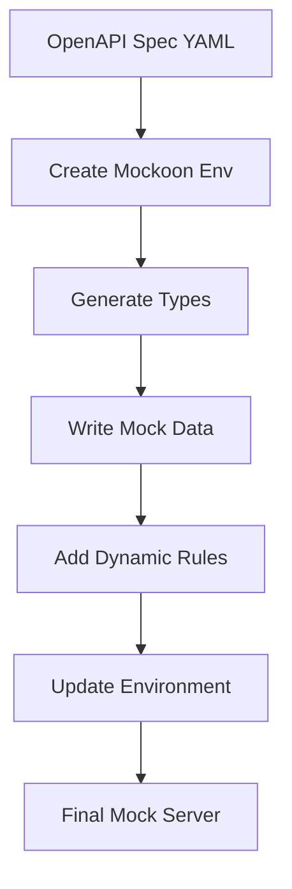

# Optum Perks Online Care Mock Server

A dynamic mock server that provides OpenAPI spec-compliant endpoints for the Optum Perks Online Care API. Built with Mockoon and designed for both development and testing environments.

## Table of Contents

- [Quick Start](#quick-start)
- [Pipeline Process](#pipeline-process)
- [Development Guide](#development-guide)
- [Deployment](#deployment)
- [Configuration](#configuration)
- [Troubleshooting](#troubleshooting)

## Quick Start

### Local Development

```bash
# Install dependencies
npm install

# Generate mock data
npm run pipeline

# Start server
npx mockoon-cli start -d ./src/mockoon_env.final.json
```

### Docker

```bash
# Build and start
docker compose up --build

# Access the server
curl http://localhost:3005/api/v1
```

The mock server will be available at `http://localhost:3005/api/v1`

## Pipeline Process

The mock server automatically transforms an OpenAPI specification into a functioning mock server through a series of steps:



### Pipeline Steps

1. **Create Mockoon Environment** (`npm run create-mockoon`)
   - Converts OpenAPI spec to Mockoon config
   - Sets up base routes and responses

2. **Generate API Types** (`npm run api-types`)
   - Creates TypeScript definitions
   - Ensures type safety

3. **Write Mock Data** (`npm run write-data`)
   - Generates spec-compliant dynamic response chains
   - Populates data templates

4. **Add Dynamic Rules** (`npm run add-rules`)
   - Configures path parameters
   - Sets up response rules

5. **Update Environment** (`npm run update-env`)
   - Configures server settings
   - Sets final environment

### Running the Pipeline

```bash
# Run entire pipeline
npm run pipeline

# Or run steps individually
npm run create-mockoon
npm run api-types
npm run write-data
npm run add-rules
npm run update-env
```

## Development Guide

### Project Structure

```
├── config/                 # API specification
│   └── openapi.yml        # OpenAPI spec file
├── scripts/               # Build and generation scripts
│   ├── pipeline.js        # Main pipeline script
│   ├── apiTypes.js        # Type generation
│   └── ...               # Other utilities
├── src/
│   ├── responses/         # Response templates
│   ├── mock-data/        # Mock data sources
│   └── mockoon_env.final.json  # Mockoon configuration
└── docker-compose.yml    # Docker configuration
```

### Updating Mock Data

The mock server configuration should never be edited manually. To update:

1. **Update API Specification**

   ```bash
   # 1. Replace OpenAPI spec
   cp new-spec.yml ./config/openapi.yml
   
   # 2. Run pipeline
   npm run pipeline
   ```

2. **Add New Mock Data**
   - Add templates to `src/responses/`
   - Add data sources to `src/mock-data/`
   - Run `npm run write-data`

3. **Modify Response Rules**
   - Update rules in response templates
   - Run `npm run add-rules`

### Available Endpoints

Base URL: `http://localhost:3005/api/v1`

Example endpoints:

- GET `/conditions`
- GET `/conditions/:id`
- [Add other key endpoints here]

## Deployment

### Docker Production Deployment

```bash
# Build production image
docker build -t your-registry/mockoon-server:version .

# Push to registry
docker push your-registry/mockoon-server:version

# Deploy
docker compose -f docker-compose.prod.yml up -d
```

### Environment Variables

```bash
# .env file
PORT=3005
NODE_ENV=production
```

## Configuration

### Pipeline Configuration

- Pipeline behavior can be modified in `scripts/pipeline.js`
- Custom steps can be added through `package.json` scripts
- Error handling can be adjusted in pipeline scripts

### Mockoon Configuration

- Port settings in `src/mockoon_env.final.json`
- Response delays and codes in response templates
- Dynamic rules in route configurations

## Troubleshooting

### Common Issues

1. **Pipeline Failures**

   ```bash
   # Check pipeline logs
   npm run pipeline -- --verbose
   ```

2. **Missing Mock Data**

   ```bash
   # Regenerate mock data
   npm run write-data
   ```

3. **Server Won't Start**
   - Check port availability
   - Verify JSON configuration
   - Ensure all dependencies are installed

### Error Messages

- `Failed: Create Mockoon JSON env`
  - Verify OpenAPI spec format
  - Check file permissions

- `Error: Port already in use`
  - Change port in environment variables
  - Kill existing server process

### Getting Help

- Check [Mockoon documentation](https://mockoon.com/docs/)
- Review pipeline logs
- Verify OpenAPI spec compatibility

## Contributing

1. Never edit `mockoon_env.final.json` manually
2. Run full pipeline after changes
3. Test all endpoints before deployment
4. Maintain type safety with generated types

---

For more information about Mockoon, visit [mockoon.com](https://mockoon.com)
